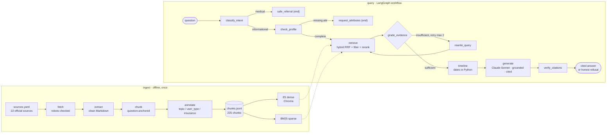

> ⚠️ **Not medical or legal advice — a portfolio prototype.** NurtureDE reports what official
> sources say and cites them. It never decides eligibility, never states what applies to your
> situation, and refuses medical questions — see a doctor, a midwife (*Hebamme*), or call **112**
> in an emergency.

# NurtureDE

A question-answering assistant that answers **only** from a curated set of *official* German
sources about pregnancy, maternity protection (*Mutterschutz*), and family benefits
(*Elterngeld*, *Kindergeld*, *Mutterschaftsgeld*, *Elternzeit*) — and **cites every claim back to
the page it came from**. Built for internationals in Germany who can't find, or don't know the
German words for, information that officially exists.

### ▶ See it work in 90 seconds

**[Open the pipeline visualiser →](https://claude.ai/code/artifact/368eeb82-901d-411e-9725-b7a8f840f0d4)**
— a static page that shows, for one real question, how the system decides: the routing branches,
the cross-lingual retrieval where the correct German answer sat at rank 6 and was recovered by
reranking, the bounded retry loop, and where the latency actually goes. It's the fastest way to
understand what's below.

**▶ Try it live:** **[NurtureDE on HuggingFace Spaces →](https://huggingface.co/spaces/Shwey13/nurture-de)**
— ask a real question in English or German and get a cited answer. *(Free-tier demo — the first
request after it's been idle can take up to a minute to wake and answer.)*

## Why this problem

The information is public, but it's *inaccessible*: fragmented across health, employment, benefits,
and insurer portals; almost entirely in German; and written in terms you can't search for if you
don't already know them. You can't look up the rule about paid time off for prenatal appointments
if you've never heard the word *Freistellung*, and you can't ask your employer about protection
periods without *Mutterschutzfrist*. A system that finds the right German passage and hands it to
you **in your language, with the German term attached**, closes that gap. That premise —
cross-lingual answering — is the core feature, not a nicety.

## Architecture



Retrieval is **hybrid**: dense multilingual embeddings (`intfloat/multilingual-e5-large`) carry
cross-lingual and compound meaning; BM25 over the displayed text catches exact rare tokens (whole
German compounds like *Mutterschutzfrist*); the two are fused with Reciprocal Rank Fusion, metadata-
filtered, and reranked by a cross-encoder (`bge-reranker-v2-m3`) over a 100-candidate pool. The
orchestration is a **workflow, not an agent** — fixed code paths with two routing branches and one
bounded retry loop — because a missed legal deadline is the failure this exists to prevent, so
*bounded and traceable* beats *flexible*. Everything sits behind one swappable `search()` interface.
Generation is a single grounded, cited **Claude** call — the live demo runs **Claude Sonnet** for
latency (generation dominates query time once the reranker is hosted), and it's swappable across
Claude models via the `GEN_MODEL` env var. Retrieval is model-independent, so this choice doesn't
affect the recall figures below.

## What it does — and deliberately doesn't

| Does | Doesn't |
|---|---|
| Reports what a source says, incl. amounts and durations, with citations | Never tells you what applies to *you*; never decides eligibility |
| Answers an English question from a German source, surfacing the German term | Never invents a chunk id or answers from outside the corpus |
| Asks for your employment / insurance status when the answer depends on it | Never assumes the default persona and answers confidently |
| Refuses medical questions and refers to a doctor / midwife / 112 | Never gives clinical judgement, even from adjacent text |
| Leaves date/amount arithmetic to **Python** and the deciding authority | Never states a benefit amount *as your entitlement* |
| Flags manipulative / injected text in a source | Stores nothing; every answer is grounded in that request's retrieved context |

## Two ways to use it

The same corpus + tools are exposed through two interfaces:

**1. A live web demo (for people).** [NurtureDE on HuggingFace Spaces](https://huggingface.co/spaces/Shwey13/nurture-de)
— a Gradio page: type a question, read a cited answer. The reranker is offloaded to a hosted API
(the only production swap); E5 query-embedding, Chroma, and BM25 run in-container from a text index
rebuilt at startup, and `graph.py` is unchanged.

**2. An MCP server (for AI agents).** `mcp_server.py` exposes the system over the **Model Context
Protocol**, so any MCP client (Claude Desktop, Claude Code, Cursor, …) can call it over stdio:
- **Tools** — `search_official_information` (cited retrieval), `calculate_pregnancy_timeline`
  (deterministic dates), `explain_german_administrative_term`
- **Resource** — `germany-family-support://topics` (coverage list) · **Prompt** —
  `prepare_expat_pregnancy_plan`

Connect it with an MCP config (as in [`.mcp.json`](.mcp.json)):

```json
{
  "mcpServers": {
    "germany-family-support": {
      "command": ".venv/Scripts/python.exe",
      "args": ["mcp_server.py"]
    }
  }
}
```

Same grounding rules in both: the tools report what official sources *say*, always return chunk ids,
and never decide eligibility or answer medical questions.

## Results

The system prompt fix and the `RERANK_POOL=100` fix were measured together against a golden set of
**56 cases** (43 scored on the answering + medical subset), Claude Opus held constant as the eval
generator (the live demo runs Sonnet for latency; the model doesn't affect retrieval recall),
graded by a cheaper judge (Haiku 4.5). Every figure below is traceable to a file — the
full ledger is [`knowledge/figure-audit-2026-08-13.md`](knowledge/figure-audit-2026-08-13.md), and
the behaviour/recall table is auto-written by `eval/rescore.py` to
[`eval/results.md`](eval/results.md).

| metric | before → after | what moved it |
|---|---|---|
| **recall@5** (answerable, n=26) | **0.75 → 0.90** | wider rerank pool (100) recovered cross-lingual chunks |
| **behaviour match** | **38% → 58%** | prompt fix + rerank pool 100 — *system improvement* |
| **behaviour match** | **58% → 69%** | after correcting five golden-set labels — *ruler correction* |
| **citation validity** | **219/220 ≈ 100%** | when it cites, the source supports the claim |

Both behaviour arrows are shown deliberately: 38→58 is the system getting better; 58→69 is where I
corrected my own measuring instrument (labels that were stricter than the corpus warranted). A lone
69% would look like tuning; a lone 58% would understate it. (All-43 basis: 65% → 77%.)

**Latency is reported as a share, never absolute seconds** — CPU wall-clock varies run to run.
Measured end-to-end: **retrieval is 86–89% of user-perceived latency, generation only 5–10%** — the
cross-encoder rerank on CPU dominates. (Split file-backed in
[`docs/visualiser/traces.json`](docs/visualiser/traces.json).)

## Selected findings

Each with its number; each caught by measuring or by reading an intermediate artifact, not the
final output.

- **The rank-6 discard.** On an English question about a German-only rule, the correct German chunk
  was retrieved at fused **rank 6** and cut by the top-4 context window — the system said it had no
  information while holding the answer. A 100-candidate rerank pool recovered **5 of 6** such
  cross-lingual cases into the top-4. (P8)
- **The starved-reranker retraction.** I first reported "reranking barely helps." Wrong — and the
  interesting part is why: the harness fed the cross-encoder a 10-candidate pool while the chunks it
  needed sat at ranks 20–43, so it never saw them. The component was fine; the *measurement* was
  invalid. (P8)
- **Question-anchored chunking.** Familienportal encodes hierarchy by *convention* (every heading is
  `<h2>`; a trailing "?" starts a topic), not markup — so chunking had to anchor on questions. The
  *same* property later biased corpus-derived eval questions toward being too easy: one corpus
  trait, two consequences, two phases apart. (P1)
- **Silent embedding truncation.** 21 chunks exceeded E5's 512-token limit and were truncated
  *before the model saw them* — no error, just quietly degraded retrieval. The chunker had sized in
  a proxy tokenizer that **undercounts** German, the unsafe direction. Fixed by sizing against the
  real tokenizer; zero truncated. (P7)
- **The latency inversion.** I estimated generation would dominate; measured, **retrieval is
  86–89%** and generation 5–10% — the split inverted. My reasoning was right for the production
  topology and wrong for the CPU dev box it ran on; a hosted reranker is a production requirement,
  not a nice-to-have. (P11)
- **The filter vocabulary mismatch — and the pattern behind it (PM-9).** `employment_status=
  "employed"` mapped to a `user_type="employed"` filter, but the corpus tags that facet
  `"employee"`. The silent mismatch excluded *every* maternity-protection chunk. It hid because the
  system **degraded honestly** — correct deterministic dates, a truthful partial, an admission of
  what it couldn't cover — so it looked like a coverage gap; only the per-node trace showed the
  filter had emptied the pool. This is the general shape (**PM-9**): *the dangerous failures don't
  crash, they produce plausible output.* Three instances share it — the rank-6 discard, this filter
  bug, and a test that overwrote the published deliverable with fixture data — none errored, each
  caught by inspecting an intermediate artifact. The durable fix is a guard: `assert_filter_vocab()`
  **fails the build** if any filter value the code can emit matches zero chunks in the corpus. (P11)

## Honest limitations

- **Prototype scale** — 22 official sources, 225 chunks; **56 eval cases, not 500**.
- **Freshness disclosure is implemented but untestable** — the whole corpus was fetched on one day,
  so there is no date spread to trigger a staleness flag.
- **Thin English coverage** for employment/benefit topics: recall@5 is **0.94 on German** questions
  but **~0.30 on English** questions about German-only topics (the English query retrieves the
  English sources and never reaches the German document). This is the real defect, stated openly.
- Many real user questions fall outside the official portals entirely (see
  [`eval/coverage_gaps.md`](eval/coverage_gaps.md)).

## Roadmap

**Shipped:** an MCP server (P10); LangGraph orchestration instrumented per node (P11); the
[pipeline visualiser](docs/visualiser/index.html) (P12); and a
**[live deployment](https://huggingface.co/spaces/Shwey13/nurture-de)** on HuggingFace Spaces (P13).

**Deployment (P13) — thin slice, live.** First deliberately *skipped* on value (the visualiser
communicates the system better than a query box), then reversed — a URL a user can type into is
worth building. The one production swap is the reranker → a hosted API (Jina), because CPU
reranking was 86–89% of query latency; E5 query-embedding, Chroma, and BM25 run in-container from a
text index rebuilt at startup, `graph.py` unchanged, generation on Claude Sonnet for latency. Cost:
**~$0.05/query + $9/mo** for HuggingFace PRO (HF requires PRO for Gradio Spaces — the earlier
"free CPU tier" assumption did **not** hold; corrected here for honesty). **Still roadmap, deferred
on purpose:** Supabase pgvector and a hosted embedder (needed only at scale), costed in
[`knowledge/phase13-deployment-plan.md`](knowledge/phase13-deployment-plan.md).

**Still planned:** parent-document retrieval; a referral layer for questions no document can answer
(find an English-speaking doctor, book a *Geburtsvorbereitungskurs*).

## Quickstart

Requires **Python 3.11+** (chromadb / MCP / LangGraph need ≥3.10) and, for generation/eval, an
Anthropic API key.

```bash
python -m venv .venv && . .venv/Scripts/activate         # Windows cmd: .venv\Scripts\activate
pip install -r requirements.txt --extra-index-url https://download.pytorch.org/whl/cpu

echo "ANTHROPIC_API_KEY=sk-ant-..." > .env               # gitignored; never committed

python src/index.py                                      # build the dense+sparse index (see note)
python src/ask.py "Wann beginnt die Mutterschutzfrist?"  # ask; add --trace for the full pipeline
```

> **First `index.py` run is slow and mostly silent.** It downloads `multilingual-e5-large`
> (**~2.2 GB**) and embeds the 225 committed chunks on CPU — a **one-time build of ~45 minutes**
> (measured on this CPU box under load). E5 is loaded in fp16 to fit memory, and CPUs don't
> accelerate fp16, so the build is compute-bound; a GPU or an fp32 box is far faster. After the
> one-time build, `ask.py` is fast. The committed corpus is `data/chunks.jsonl`; the raw pages and the
> vector store are intentionally **not** committed — re-acquiring the corpus
> (`fetch → extract → chunk → annotate`) re-downloads from the official sources and is only needed
> for corpus maintenance.

`python eval/run_eval.py` runs the evaluation (resumable, budget-guarded); `python eval/rescore.py`
re-scores a saved run against the current labels and writes [`eval/results.md`](eval/results.md).

## More

- **[`BUILD_JOURNAL.md`](BUILD_JOURNAL.md)** — the build narrative and problem register (P1–P14):
  why the corpus looks the way it does, every problem and how it was diagnosed, the design
  decisions, and the full findings.
- **[`knowledge/`](knowledge/)** — architecture decisions, past-mistakes (the reusable lessons incl.
  PM-9/PM-10), the figure audit, and the talk-track.
