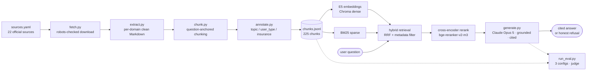

> ⚠️ **Not medical or legal advice — a portfolio prototype.** NurtureDE reports what official
> sources say and cites them. It never decides eligibility, never states what applies to your
> situation, and refuses medical questions — see a doctor, a midwife (*Hebamme*), or call **112**
> in an emergency.

# NurtureDE

A question-answering assistant that answers **only** from a curated set of *official* German
sources about pregnancy, maternity protection (*Mutterschutz*), and family benefits
(*Elterngeld*, *Kindergeld*, *Mutterschaftsgeld*, *Elternzeit*) — and **cites every claim back
to the page it came from**. Built for internationals in Germany who can't find, or don't know
the German words for, information that officially exists.

## Why this problem

The information is public, but it's *inaccessible*: fragmented across health, employment,
benefits, and insurer portals; almost entirely in German; and written in terms you can't search
for if you don't already know them. You can't look up the rule about paid time off for prenatal
appointments if you've never heard the word *Freistellung*, and you can't ask your employer
about protection periods without *Mutterschutzfrist*. A system that finds the right German
passage and hands it to you **in your language, with the German term attached**, closes that
gap. That premise — cross-lingual answering — is the core feature, not a nicety.

## Architecture



Retrieval is **hybrid**: dense multilingual embeddings (`intfloat/multilingual-e5-large`) carry
cross-lingual and compound meaning; BM25 over the displayed text catches exact rare tokens
(whole German compounds like *Mutterschutzfrist*); the two are fused with Reciprocal Rank Fusion
and an optional cross-encoder rerank. Generation is a single grounded Claude Opus 5 call behind
one swappable `search()` interface, so the local models can be replaced with hosted endpoints
for deployment without rewrites.

## What it does — and deliberately doesn't

| Does | Doesn't |
|---|---|
| Reports what a source says, incl. amounts and durations, with citations | Never tells you what applies to *you*; never decides eligibility |
| Answers an English question from a German source, surfacing the German term | Never invents a chunk id or answers from outside the corpus |
| Asks for your employment / insurance status when the answer depends on it | Never assumes the default persona and answers confidently |
| Refuses medical questions and refers to a doctor/midwife/112 | Never gives clinical judgement, even from adjacent text |
| Flags when a source contains manipulative/injected text | Never states a benefit amount *as your entitlement* |
| Leaves date/amount arithmetic to code and the deciding authority | Stores nothing; every answer is grounded in that request's retrieved context |

## Results (Phase 8 — first honest run, nothing tuned)

56 golden questions × 3 retrieval configs, Claude Opus 5 held constant as the generator, graded
by a cheaper judge (Haiku 4.5). **This is a prototype, not a finished system** — the numbers
below are the first clean measurement, warts included.

| config | recall@5 | behaviour match | citation validity |
|---|---|---|---|
| dense | 0.73 | 35% | 100% |
| hybrid | 0.69 | 31% | 100% |
| hybrid + rerank | **0.75** | **38%** | 100% |

Read honestly, the low behaviour-match is **mostly not a wrong-answer problem** — it decomposes
into (1) the generator appending a caveat to every answer, so the judge labels it "partial"
though the answer is correct; (2) some eval labels being stricter than the corpus warranted; and
(3) one genuine defect: **cross-lingual retrieval recall is 0.94 on German questions but 0.30 on
English questions about German-only topics** — the English query retrieves the English sources
and never reaches the German document that holds the answer. Citation validity is 100%: when it
cites, the source supports the claim. Full per-case breakdown in [`BUILD_JOURNAL.md`](BUILD_JOURNAL.md).

## Selected findings

- **Silent embedding truncation, caught by measuring.** 21 chunks exceeded E5's 512-token limit
  and were truncated *before the model saw them* — the chunker sized in cl100k (a proxy), which
  **undercounts** German at the tail, the unsafe direction. Fixed by sizing against the real
  tokenizer; max is now 500, zero truncated. (P7)
- **The corpus's structure dictated the chunker.** Familienportal encodes hierarchy by
  *convention* (every heading is `<h2>`; a trailing "?" starts a topic), not markup — so a
  heading-ratio classifier misfired, and question-anchored chunking was necessary. The *same*
  property later biased the eval questions toward being too easy: one corpus trait, two
  consequences, two phases apart. (P1)
- **Cross-lingual retrieval gap.** recall@5 0.30 (EN→DE-only topics) vs 0.94 (DE). Phase-4's 0.86
  cross-lingual score was measured on *parallel translated* content — the easy case; the hard
  case (an English query reaching German-only content with no English twin) was never tested and
  is where recall collapses.
- **Hybrid's edge is marginal here.** dense 0.73 ≈ rerank 0.75 > hybrid 0.69 — the reranker adds
  a little, RRF slightly hurt; a small *measured* gain, not the large assumed one. The sparse
  index earns its place by rank-rescuing exact-match chunks dense buries, not by beating dense.

## Roadmap

**Planned:** an MCP server exposing `search`; LangGraph orchestration (ask-for-attributes ↔
retrieve ↔ answer as a graph); a pipeline visualiser (the retrieval trace is already emitted for
it); a referral layer for questions no document can answer (find an English-speaking doctor, book
a *Geburtsvorbereitungskurs*); deployment with a hosted embedder + Supabase pgvector.

**Known limitations:** prototype scale (22 sources); freshness disclosure is implemented but
**untestable** — the whole corpus was fetched on one day, so there is no date spread; thin
English coverage for employment/benefit topics (the source of the cross-lingual gap); many real
user questions fall outside the official portals entirely (see [`eval/coverage_gaps.md`](eval/coverage_gaps.md)).

## Run it

Requires **Python 3.11+** (chromadb / MCP / LangGraph need ≥3.10) and, for generation/eval, an
Anthropic API key.

```bash
python -m venv .venv && . .venv/Scripts/activate         # Windows cmd: .venv\Scripts\activate
pip install -r requirements.txt --extra-index-url https://download.pytorch.org/whl/cpu

echo "ANTHROPIC_API_KEY=sk-ant-..." > .env               # gitignored; never committed

python src/index.py                                      # build dense+sparse indexes (downloads E5 ~2.2GB, first run)
python src/ask.py "Wann beginnt die Mutterschutzfrist?"  # ask; add --trace for the full pipeline
python eval/run_eval.py                                  # run the evaluation (resumable, budget-guarded)
```

The committed corpus ships as `data/chunks.jsonl` (the reasoned, tagged chunks). The raw fetched
pages and the vector store are intentionally **not** committed — re-acquiring the corpus
(`src/fetch.py` → `extract.py` → `chunk.py` → `annotate.py`) re-downloads from the official
sources and is only needed for corpus maintenance.

## More

- **[`BUILD_JOURNAL.md`](BUILD_JOURNAL.md)** — the build narrative and problem register (P1–P8):
  why the corpus looks the way it does, every problem and how it was diagnosed, the design
  decisions, and the full Phase-8 findings.
- **[`knowledge/`](knowledge/)** — architecture decisions, past-mistakes (the reusable lessons),
  and the talk-track.
- **[`PHASES.md`](PHASES.md)** — a plain-language, phase-by-phase tour.
