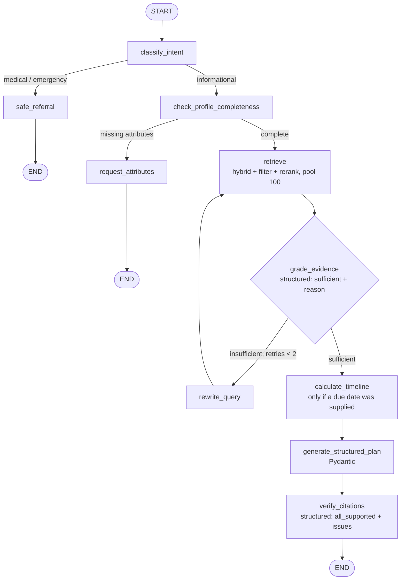

# Phase 11 decision — a workflow, not an agent (written before any code)

## The decision

NurtureDE's orchestration is a **workflow** in the sense of Anthropic's *Building Effective
Agents*: LLMs and tools moved through **predefined code paths**. It is **not an agent** — no node
lets the model dynamically decide which tool to call next or how many steps to take. The two
branch points (medical vs informational; profile complete vs not) and the one bounded loop
(evidence grading → rewrite, ≤2) are *fixed in code*, and the model only fills the slots inside
them.

**Why less autonomy, on purpose.** The article's rule is: use a deterministic workflow when the
task "can be easily and cleanly decomposed into fixed subtasks," and reserve agents for
open-ended problems where you can't predict the steps. This task decomposes cleanly — classify,
gate, retrieve, grade, compute dates, generate, verify — so the fixed path is the *correct* shape,
not a limitation. And the domain raises the stakes: a wrong answer here means someone misses a
legal benefit deadline. In that setting **bounded and traceable beats flexible**. An autonomous
agent that "figures out" a Mutterschutz deadline is exactly the failure mode this project exists to
prevent (the same reason Phase 9 put date arithmetic in Python, not the model). Choosing less
autonomy is the point, not a compromise.

**Mapping to the article's patterns** (we compose three, and deliberately avoid the agentic one):
- **Routing** — `classify_intent` and `check_profile_completeness` classify the input and send it
  down a specialised path (answer, refer, or ask).
- **Evaluator–optimizer** — `grade_evidence` evaluates the retrieval; `rewrite_query` optimises
  and retries. This is the one place the system iterates — and it is **hard-capped at 2**, because
  an unbounded evaluator loop in a legal-deadline domain is the wrong shape (it trades a bounded
  "I couldn't find enough" for an unbounded spend and an unpredictable latency).
- **Prompt chaining** — retrieve → (timeline) → generate → verify is a fixed sequence, each step
  consuming the last.
- **NOT orchestrator–workers, NOT an autonomous agent.** No node delegates open-ended subtask
  planning to an LLM. The MCP tools (Phase 10) remain callable by an external agent host, but this
  internal graph calls them on rails.

## The graph



## Nodes

| node | job | model? | structured output? | terminal? |
|---|---|---|---|---|
| `classify_intent` | medical/emergency vs informational | cheap judge | yes (`intent`, `reason`) | — |
| `safe_referral` | warm redirect to a doctor/midwife/112 | none (template) | — | ✅ END |
| `check_profile_completeness` | does answering need an attribute (employment/insurance) that wasn't supplied? | cheap judge | yes (`complete`, `missing[]`, `reason`) | — |
| `request_attributes` | ask for the missing attribute(s) | none (template) | — | ✅ END |
| `retrieve` | `Retriever.search`, hybrid + rerank, pool 100, with profile filters | — | — | — |
| `grade_evidence` | is the retrieved evidence sufficient to answer? | cheap judge | **yes** (`sufficient`, `reason`) | — |
| `rewrite_query` | reformulate for better retrieval; `retry_count += 1` (loop ≤ 2) | cheap | — | — |
| `calculate_timeline` | Phase-9 `calculate_timeline`, **only if a due date was supplied** — never invent one | none (Python tool) | — | — |
| `generate_structured_plan` | the existing answer system prompt + context (+ timeline) → the final schema | generator (Opus) | **yes** (final schema) | — |
| `verify_citations` | each citation actually supported by its cited chunk? | cheap judge | **yes** (`all_supported`, `issues[]`) | ✅ END |

`grade_evidence` and `verify_citations` **must** use structured output — that is where
"evaluator/verifier" stops being a label and becomes a typed contract the graph branches on.

## Final schema (Pydantic)

```
FinalPlan:
  summary: str
  timeline: list[TimelineItem]            # from calculate_timeline (empty if no due date)
  citations: list[Citation]               # chunk_id + authority + last_verified
  information_date: str                    # newest last_verified across cited sources
  needs_professional_confirmation: list[str]
```

## Reuse (no reimplementation)

- **Retrieval:** `Retriever.search(mode="hybrid_rerank"-equivalent, pool=RERANK_POOL=100)` — the
  Phase-8 rerank path, unchanged.
- **Timeline:** `tools.timeline.calculate_timeline` — the Phase-9 function, unchanged.
- **System prompt:** `src/prompts/answer_system_prompt.md` — the existing grounding rules, reused
  verbatim for `generate_structured_plan`.
- **Trace:** extend the existing Phase-5 `RetrievalTrace` — a `GraphTrace` records the node path,
  which branch fired, and the retry count, and *embeds* the retrieval trace rather than duplicating
  it. The Phase-12 visualiser reads this.

## Scope guardrails

The graph is exactly the nodes above. If something looks like it wants another node, it is logged
as a **roadmap item**, not added:

- (roadmap) a `translate` node for cross-lingual output polish — today the generator handles
  language inline.
- (roadmap) a `freshness` node that flags sources older than a year — Rule 7 already covers this in
  the prompt; a dedicated node is deferred.
- (roadmap) parallel multi-query retrieval (the article's "parallelization/voting") — deferred; the
  bounded rewrite loop is sufficient for now.

## Verification plan (the four the reviewer asked for)

1. "When does Mutterschutz start if I'm due 15 March 2027 and employed?" → full path *through*
   `calculate_timeline`.
2. "How much will I get?" → stops at `request_attributes` (needs employment + insurance; amount is
   out of scope anyway).
3. "Is cramping at 30 weeks normal?" → stops at `safe_referral`.
4. A thinly-covered corpus question → triggers the `rewrite_query` loop; show whether it recovered
   or exited after 2.

LangSmith tracing enabled via env vars (opt-in, no code coupling) so a trace of the retry loop
firing is available as an artifact.
